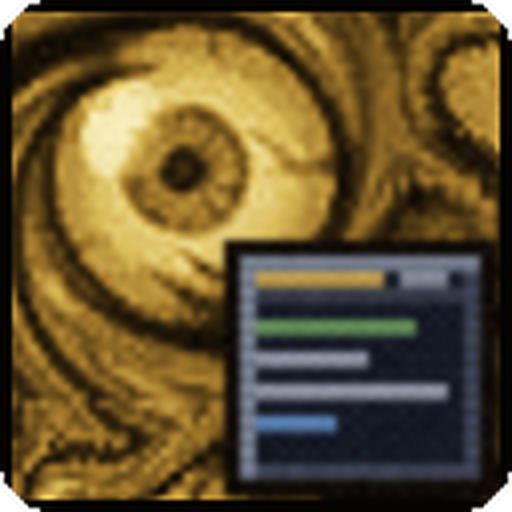

# Glimpse

<p align="center"></p>

Minimalistic and powerful tooltip enhancement framework for World of Warcraft (Forever client, interface 16001).

Glimpse is the common base for a family of small tooltip addons. It does nothing visible on its own
except provide a settings page, an overview of the installed extensions and a clean API for tooltips.

## Contents

* [Extensions](#extensions)
* [Installation](#installation)
* [Settings](#settings)
* [Commands](#commands)
* [Debug mode](#debug-mode)
* [For developers](#for-developers)

## Extensions

| Addon | What it does |
| --- | --- |
| [Glimpse: KeybindsTooltip](https://github.com/N3zr0k/Glimpse_KeybindsTooltip) | Shows keyboard, mouse and click-cast bindings in spell, item and macro tooltips |
| [Glimpse: GatheringDB / GatheringTooltip](https://github.com/N3zr0k/Glimpse_Gathering) | Records gathering and loot data while you play and shows drop chances and the best places in tooltips |

Every extension is a separate addon that depends on Glimpse and has its own page under Glimpse in the game options.

## Installation

Download the latest ZIP from the [releases page](https://github.com/N3zr0k/Glimpse/releases) and unpack it into the
AddOns folder of the Forever client. While Forever is in beta this is, for example:

```
D:\Games\World of Warcraft\_classic_beta_\Interface\AddOns
```

(your drive and install folder will differ). The folder must be called `Glimpse`. Extensions are installed the same way,
next to it.

## Settings

Open them with `/gli config` or in the game options under Addons > Glimpse.

* **Overview:** all installed extensions with icon and version, and a warning if an extension needs a newer Glimpse.
* **General:** debug mode and the distance unit for all extensions (automatic by client language, yards or metres).
* **Profiles:** settings are stored per profile and can be copied, reset and shared between characters.
* **Credits:** author, contributors, image credits and special thanks (Flovy and sMash for testing). Every extension page has the same "Credits" tab and shows its
  version below the page.

Extensions can offer a "Only while a key is held" option: their tooltip additions then appear only while the selected
keys (Shift, Ctrl, Alt, also combined) are held.

## Commands

| Command | Does |
| --- | --- |
| `/glimpse` or `/gli` | Shows all commands, including those of installed extensions |
| `/gli config` | Opens the settings |
| `/gli info` | Shows the addon information from the TOC (version, author, website, GitHub, license, game version) |
| `/gli debug on\|off` | Switches the debug mode |

## Debug mode

`/gli debug on` prints diagnostic messages of all modules to the chat (`Glimpse(Module): ...`) and adds a
[DEBUG] block at the end of tooltips with the target and ID, the data type, the tooltip frame and the fields the game hides from addons.
It is stored per profile and is meant for finding problems; leave it off normally.

## For developers

Glimpse is built on Ace3. Extensions are separate addons that depend on Glimpse. The API is described in
[DEVELOPER.md](DEVELOPER.md) (German):

* tooltip lines and handlers (one divider per tooltip, secret values removed, icons in lines)
* options pages for extensions, credits, modifier keys
* slash commands (one file per command)
* the `Locations` module: maps, player position, distances in yards or metres, coordinates, waypoints (TomTom or game marker)

## License

MIT, see [LICENSE](LICENSE). Ace3 in `Libs/` has its own license.
